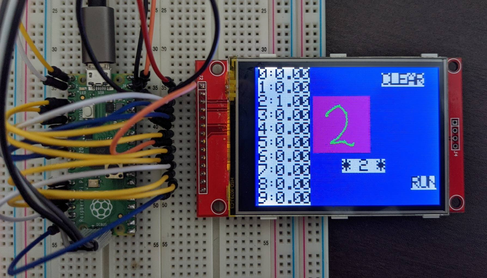

# About
Number recognition with MNIST on Raspberry Pi Pico + TensorFlow Lite for Microcontrollers


## Device


- Raspberry Pi Pico
- LCDディスプレイ 2.8"240x320 SPI TFT LCDタッチパネルシリアルポートモジュール+ PCB ILI9341 5V / 3.3V
	- LCD: Ili9341 (SPI)
	- Touch Panel: TSC2046 (SPI)

### Wiring
- [pj_mnist/wiring.txt](pj_mnist/wiring.txt)

## Build
```sh
git clone https://github.com/iwatake2222/pico-mnist.git
cd pico-mnist
git submodule update --init
cd pico-sdk && git submodule update --init && cd ..
mkdir build && cd build

# For Windows Visual Studio 2019 (Developer Command Prompt for VS 2019)
# cmake .. -G "NMake Makefiles" -DCMAKE_BUILD_TYPE=Debug -DPICO_DEOPTIMIZED_DEBUG=on
cmake .. -G "NMake Makefiles"
nmake

# For Windows MSYS2 (Run the following commands on MSYS2)
# cmake .. -G "MSYS Makefiles" -DCMAKE_BUILD_TYPE=Debug -DPICO_DEOPTIMIZED_DEBUG=on
cmake .. -G "MSYS Makefiles" 
make
```

## Model
- Model files, model generation (Keras) and model conversion script for Google Colaboratory are stored in [pj_mnist/conv_mnist](pj_mnist/conv_mnist)
	- [pj_mnist/conv_mnist/tflmicro_mnist.ipynb](pj_mnist/conv_mnist/tflmicro_mnist.ipynb)
- *Note* : It looks uint8 quantization is not supported. You need to use int8 quantization, or use FP32 model.

## Acknowledgements
- pico-sdk
	- https://github.com/raspberrypi/pico-sdk
	- Copyright 2020 (c) 2020 Raspberry Pi (Trading) Ltd.
- pico-examples
	- https://github.com/raspberrypi/pico-examples
	- Copyright 2020 (c) 2020 Raspberry Pi (Trading) Ltd.

- pico-tflmicro
	- https://github.com/raspberrypi/pico-tflmicro
	- Copyright 2019 The TensorFlow Authors. All Rights Reserved.
